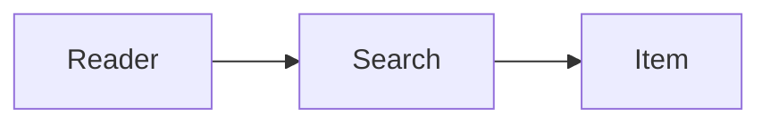

# Writing a post

Copy `content/templates/post.mdx` into this directory and give it a lowercase,
hyphen-separated filename, such as `a-small-beginning.mdx`.
That filename becomes `/posts/a-small-beginning/`.

```yaml
---
title: "A small beginning"
description: "One or two sentences that appear in the post list and below the title."
date: "2026-09-15"
draft: true
thumbnail: "/thumbnails/a-small-beginning.svg"
---
```

`thumbnail` is optional. It points at a site-root path under `public/`, and
appears as a small square on the post cards. Build one from any image with:

```sh
node scripts/dot-thumbnail.mjs <image> public/thumbnails/<slug>.svg
```

That renders the picture as a 31 x 31 grid of solid circles. The script uses
macOS `sips`, so generate thumbnails locally and commit the SVG rather than
building them in CI. Keep the source image somewhere durable if you may want to
regenerate it. High-contrast subjects with large shapes survive the grid; subtle
images turn to mush.

`title` and `description` are required, nonempty strings. `date` is optional;
when present, use a real date in `YYYY-MM-DD` format. Dated posts appear newest
first, followed by undated posts sorted by filename.

## Preview and publish

1. Run `npm run dev` and open the local URL printed in the terminal.
2. Open **Posts** and select your draft. Refresh the page after saving to see your changes.
3. Replace the template text, title, description, and date with your article.
4. When ready to publish, set `draft: false` and run `npm run build`.
5. Review the changes, then push to `main` to deploy through GitHub Actions.

A draft is unlisted rather than withheld. It still builds to its own URL, so you
can send that link to a reader, but it is kept out of the homepage, the archive,
and the sitemap, and its page carries `noindex, nofollow`. Omitting `draft` means
the article is published and listed everywhere.

This is a publishing control, not privacy. Anyone with the link can read a draft,
and the source is readable in the repository.

Create new articles from `content/templates/post.mdx`.

## Markdown and MDX

The page supplies the title as its only H1, so start body sections with `##`.
Plain Markdown supports paragraphs, links, lists, blockquotes, images, and code
blocks. GitHub-style tables, task lists, and strikethrough are supported too.
Put local images in `public/` and reference them as `/image-name.jpg`, with
descriptive alt text.

### Footnotes

Use GitHub's syntax. The label can be any word; the rendered numbering follows
the order the references appear, not the label.

```md
Agents reach the same resources a person does.[^spec]

[^spec]: WebMCP, published by the W3C Web Machine Learning group.
```

References render as superscript links, and the notes collect in a separated
block at the foot of the article with a back-link to each reference. Referencing
the same note twice gives it two back-links. The block's "Footnotes" heading is
for screen readers and is deliberately kept out of the Contents menu.

### Diagrams

Use a fenced block labeled `mermaid` to render a diagram:

````md

````

A paragraph placed immediately after a diagram is styled as that diagram's
caption: smaller, muted, and tucked up close to it. Leave a blank line before
the next real paragraph so only the caption picks up that treatment.

Include `accTitle` and `accDescr` to give diagrams an accessible title and
description. Mermaid is heavy, so it loads only when a diagram is about to come into view.
Until it renders, the diagram's space is held by a pulsing placeholder.
Wide diagrams can be scrolled horizontally, including with the keyboard.
If JavaScript is unavailable or a diagram has invalid syntax, its source remains
readable. Normal code fences still render as code.

Radix components and `UIProject` are available without imports.
MDX supports JSX; wrap literal braces or angle brackets in code spans when
writing prose. Only compile trusted, repository-authored MDX.

`README.md` and files beginning with `_` are ignored. The reusable template lives
outside the posts directory so it cannot accidentally become an article.
Duplicate slugs, invalid metadata, and broken published MDX fail the build with an error.

When there are no published posts, the Posts page shows an empty state. A reserved
placeholder route renders the 404 page to satisfy Next.js 14 static export and
is excluded from the sitemap.
