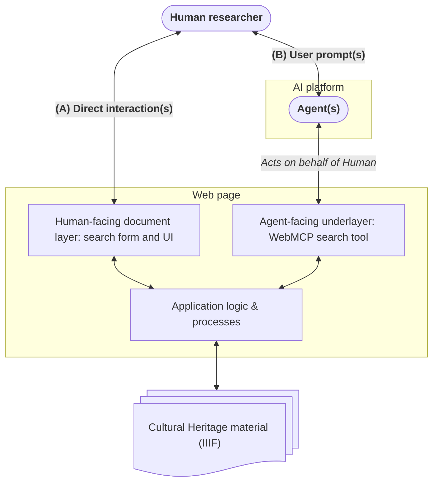

I had the pleasure of presenting work by our team at Northwestern[^team] last week at AI4LAM, hosted at the Library of Congress. Along with [James Lee](https://www.linkedin.com/in/james-lee-26a569196/), [Brendan Quinn](https://www.linkedin.com/in/brendan-quinn-487b8911/), [Kelsey Rydland](https://www.linkedin.com/in/kelseyrydland/) (from afar), and Dean [Xuemao Wang](https://www.linkedin.com/in/xuemao-wang-19010112/) supporting in the crowd, we presented on how, after many years of work, we have landed on an [IIIF](https://iiif.io/) + [WebMCP](https://webmachinelearning.github.io/webmcp/) + [C2PA](https://spec.c2pa.org/) model for supporting our digital collections infrastructure on the web. The most discussed and asked-about of these three was the novel specification WebMCP, and what it means for the future of cultural heritage, user experience, and the web in general. First, we should disambiguate WebMCP and note that it is not some sort of complex tech that only institutions with an abundance of resources can implement. It's a bridge that we can all define for use by consumer-level AI workspaces in their interaction with our web content, whether a manuscript, a map, or the metadata describing them. Right now an agent reaching a web presence is a stranger in a strange land, guessing at an interface built for someone else.[^monolith] WebMCP implementations will direct web agents working on behalf of actual humans toward tools of our own designation and the resources we want those agents to see, create better user experiences, and give us greater control over how AI platforms interact with our material.

## What is WebMCP?

I will intentionally not get into the nuts and bolts of this new tech. At its most basic, it is a set of described tools at the ready in the underlayer of any webpage,[^api] allowing an AI agent acting on a user request and reaching that page to be purposefully directed to data or actions relating to that page. These tools allow that agent to more efficiently bypass the guessing of _scrounging_ the DOM for designed-for-human elements. Instead, the agent works in an interface designed for it to make more educated decisions, and reach the information we want to provide to it. In an ideal world with good actors, these tools would mirror the interactions made available to a human visiting in a browser.[^risks] For example, if a search box is made available at the human document layer, a sibling WebMCP tool would be registered for that same search box in the agent underlayer. It's that simple.

A researcher reaches the page in two ways: directly (A) or by prompting an AI platform (B), whose agent then works the page for them. Each way needs its own interface. We have built and refined the human-facing one for decades. The agent-facing one asks us to envision an efficient network of tools mirroring that same functionality.

## Simplify our thinking

As a collective, we have confused and overcomplicated our approaches to using AI tooling for our materials. ChatGPT, Claude, and Gemini have all shifted human workspaces to easy-to-use clients and created an extra layer between our users and our materials. Meanwhile, many (including us at Northwestern)[^aimode] have experimented and developed complex tooling that demands more advanced user knowledge, increases barriers, and ultimately may support only niche use cases. This is not going to win in the long run, and certainly won't be helpful to the vast majority. Let's note how the investment in these internally focused solutions parallels the bespoke apps for iPhone and iPad (and other iThings) that many museums and universities developed in the early 2010s.[^apps] We see now that the clear winner was always simply the externally focused open web. For 30+ years, we have built websites, fine-tuned and optimized them for search engines, and readied them for users with our rich metadata. We built these atop material provided for public knowledge, and have it at the ready as IIIF resources. Let's simply show user agents sent from ChatGPT and Claude clients how to find, read, and interact with these resources, essentially bringing the information to human researchers where they already are working.

## User experience considerations

Holistically built web presences are designed with user experience and discoverability in mind. We have historically optimized our websites to be crawled and indexed by bots working for search engines. However, unlike search engine crawlers or the AI bots harvesting our collections to train a model, these new bots (we have named "agents") arrive to help answer a human's question.[^agentic] We must now also refocus our websites as portals of knowledge in support of this new user type, capable of decision-making on someone's behalf.

| | Human user | Agent user |
| --- | --- | --- |
| Arrives from | A browser, by search or a link | A prompt in ChatGPT or Claude |
| Works in | The document layer: search form and UI | The underlayer: described WebMCP tools |
| Finds by | Menus, labels, and visual hierarchy | Tool names, descriptions, and defined inputs |
| Spends | Time and attention | Tokens and response time |
| Fails by | Getting lost or giving up | Guessing and scrounging the DOM |

Agent users open up an entirely new realm of user experience considerations that, like web accessibility, span an infinite spectrum of nuance and practical solutions. These users are capable of modulating intelligence and effort level. This modulation has implications for token usage, response time, and accuracy of decision-making. Our WebMCP tool chains will need to be defined similarly to how websites have been architected with menus and user actions carefully designed for myriad humans in the browser. We should define our tools to meet the wide array of prompts a human may ask of our resources. Defining these with efficiency will provide a better experience to the agent, but more importantly, to the human at the other end seeking to interact with our material. If we can finesse our WebMCP tools correctly, human users can accurately and quickly access the material from Claude and ChatGPT clients, directly receiving the exact information and answers they sought.

## Strangers no more

Can you imagine a world where most cultural heritage institutions have WebMCP tools defined and ready for agents building responses to open-ended prompts about famous painters, authors, and singers, efficiently and in context with IIIF resources? To prepare for this changing user landscape, Northwestern introduced a baseline set of WebMCP tools into production on our [Digital Collections](https://dc.library.northwestern.edu/) on September 10, 2026. We will continue to refine this toolset and monitor results in the near future as WebMCP is implemented by AI platforms and web browsers as a supported standard. Already, ChatGPT and Google Chrome have begun to introduce support, though for now it seems only the newer, higher-effort models reach for these tools without being pushed.

We are in the early stages of a shifting web, one where agent users work on behalf of humans. Any request in ChatGPT or Claude will show us that these platforms are already using web pages and their material to find answers. Rather than waiting, maybe _we should all_ be building this new WebMCP infrastructure now, or at least experimenting with it. We need to see that the person at the other end of an AI workspace may never visit our site at all. Instead, we can meet them where they are working, with tools we define, to better guide them toward resources and rich information that we provide. Doing that now means that our material is present and legible at the moment these clients start asking in volume, and that we go on being what we have always been: the preserver and provider of knowledge, handing it over responsibly and efficiently, the same way we would to any other patron. In practice, we are being inclusive of the AI agents working within our interfaces and, by proxy, the information-seeking human.

[^team]: Our awesome developer team in Academic Innovation at Northwestern University Libraries: Mat Jordan, [Michael Klein](https://github.com/mbklein), [Brendan Quinn](https://github.com/bmquinn), and [Karen Shaw](https://github.com/kdid).

[^api]: Concretely, this is the imperative API: a page registers its tools on [`document.modelContext`](https://developer.chrome.com/docs/ai/webmcp/imperative-api), and an AI platform such as ChatGPT or Claude discovers them with `getTools()` and runs them with `executeTool()`.

[^risks]: As with all of the internet, there are risks and concerns. The WebMCP specification does not assume good actors. Its ["Key Security and Privacy Risks"](https://webmachinelearning.github.io/webmcp/#key-risks) section provides examples of malicious WebMCP tool implementations.

[^apps]: Keith Schneider, ["The Best Tour Guide May Be in Your Purse"](https://www.nytimes.com/2010/03/18/arts/artsspecial/18SMART.html), The New York Times, March 2010. SFMOMA marked its 75th anniversary by handing visitors iPod Touches loaded with five hours of content on 200 works, and the article notes "almost every major art museum in the country" following in step. The same pattern is visible today in the heavy investment in chatbots and MCP servers built around closed vector data.

[^monolith]: Perhaps this is how an agent is reacting to our DOM: [the Dawn of Man sequence in 2001: A Space Odyssey](https://youtu.be/ypEaGQb6dJk?t=151).

[^aimode]: Northwestern's [Digital Collections](https://dc.library.northwestern.edu/) released an "AI Mode" chatbot of our own making in the summer of 2024. It asks a researcher to come to our site, log in, and learn its interface; it taxes our budget, because we pay for the tokens; and it answers only questions about our own set of data.

[^agentic]: Juha Henriksson, director of Music Archive Finland, drew this line in ["Cultural Heritage in the Era of Agentic AI"](https://drive.google.com/file/d/1CXfV7Ae4EX_G7tNCRhyBaQuN0dBUSOLp/view), a lightning talk at AI4LAM Fantastic Futures, Library of Congress, September 17, 2026: the AI harvesting our material to train a model is a different user from the AI working directly on behalf of a person.
